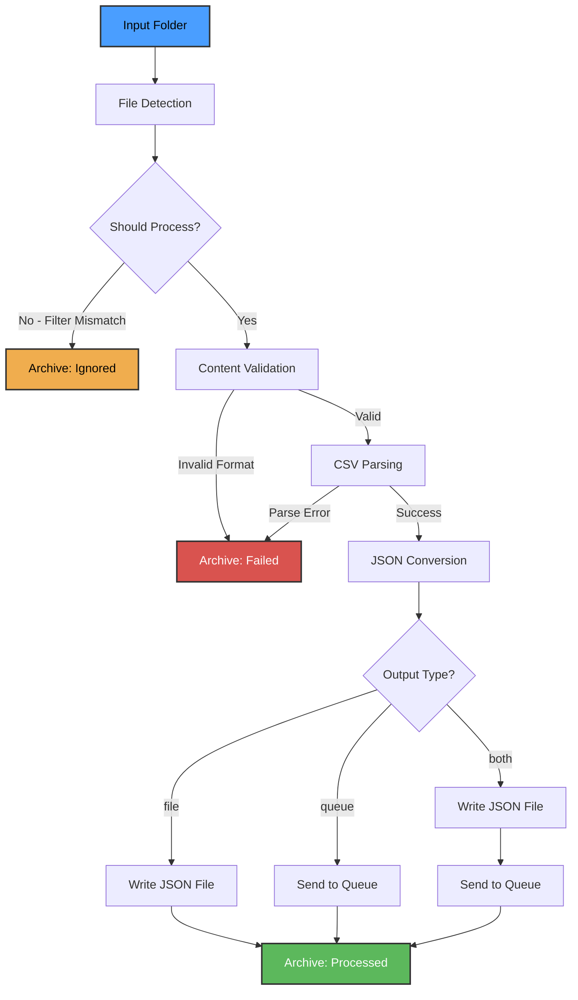

# csv2json - CSV/Delimited File to JSON Conversion Service

A high-performance, production-ready file polling service written in **Go** that monitors directories for CSV/delimited files, validates them, converts them to JSON format, and routes outputs to files or message queues.

**Built with Go for:**

- ⚡ Superior performance and low memory footprint
- 🔄 Efficient concurrency with goroutines
- 📦 Single binary deployment (no runtime dependencies)
- 🛡️ Long-running reliability for 24/7 operation
- 🚀 Fast startup and predictable performance

> **Design Decision:** See [ADR-001: Why Go over Python](docs/adrs/ADR-001-use-go-over-python.md) for the detailed
> rationale behind choosing Go for this always-on service.

## Features

- **Two Operational Modes**:
  - **Legacy Mode**: Single input folder → single output destination
  - **Multi-Ingress Routing Mode**: Multiple input folders → multiple output destinations ([ADR-004](docs/adrs/ADR-004-multi-ingress-routing-architecture.md))
- **Continuous File Monitoring**: Polls specified directories for new files
- **Flexible Format Support**: Handles CSV and other delimited formats (TSV, pipe-delimited, etc.)
- **Content Validation**: Validates file content regardless of file extension
- **Configurable Filtering**: Per-route filename patterns and suffix filtering
- **Multiple Output Options**: Write JSON to files or message queues (RabbitMQ via AMQP)
- **Route Context**: Automatic source tracking in queue messages for multi-ingress mode
- **Intelligent Archiving**: Separate locations for processed, ignored, and failed files
- **Quote Handling**: Supports both quoted and unquoted field values
- **Configuration-Driven**: Routes defined via JSON config or environment variables

> **Message Queue Support:** RabbitMQ is the primary supported queue system. See [ADR-002: Why RabbitMQ](docs/adrs/ADR-002-use-rabbitmq-for-queuing.md) for the decision rationale. AWS SQS and Azure Service Bus support are planned for future releases.

## Architecture

### Legacy Single-Input Mode



### Multi-Ingress Routing Mode ([ADR-004](docs/adrs/ADR-004-multi-ingress-routing-architecture.md))

```mermaid
flowchart TB
    subgraph Routes["Configuration-Driven Routes"]
        R1[Route: Products<br/>products/ → products_queue]
        R2[Route: Orders<br/>orders/ → orders_queue]
        R3[Route: Accounts<br/>accounts/ → file output]
    end
    
    subgraph Service["Single Service Instance"]
        P1[Processor 1]
        P2[Processor 2]
        P3[Processor 3]
    end
    
    R1 --> P1
    R2 --> P2
    R3 --> P3
    
    P1 --> Q1[products_queue<br/>with route context]
    P2 --> Q2[orders_queue<br/>with route context]
    P3 --> F[File Output]
    
    style R1 fill:#4a9eff,stroke:#333,stroke-width:2px,color:#000
    style R2 fill:#4a9eff,stroke:#333,stroke-width:2px,color:#000
    style R3 fill:#4a9eff,stroke:#333,stroke-width:2px,color:#000
    style Q1 fill:#5cb85c,stroke:#333,stroke-width:2px,color:#fff
    style Q2 fill:#5cb85c,stroke:#333,stroke-width:2px,color:#fff
    style F fill:#5cb85c,stroke:#333,stroke-width:2px,color:#fff
```



### Component Flow

1. **File Detection**: Monitor polls input folder at configured interval
2. **Filtering**: Check filename pattern and suffix filters
3. **Validation**: Verify file contains expected delimited format
4. **Parsing**: Read CSV/delimited data with configured delimiter and quote character
5. **Conversion**: Transform parsed data to JSON structure
6. **Output**: Write to file system or send to message queue
7. **Archiving**: Move processed file to appropriate archive folder

## Configuration

All configuration is managed through environment variables. The service supports two operational modes:

### Mode Selection

| Variable         | Description                                                              | Default |
|------------------|--------------------------------------------------------------------------|---------|
| `ROUTES_CONFIG`  | Path to `routes.json` for Multi-Ingress Routing Mode. If empty, runs in Legacy Single-Input Mode | -       |

**If `ROUTES_CONFIG` is set:** Service runs in **Multi-Ingress Routing Mode** (see below).  
**If `ROUTES_CONFIG` is empty:** Service runs in **Legacy Single-Input Mode** using environment variables below.

### Legacy Single-Input Mode Configuration

### Input Settings

| Variable                        | Description                                                       | Default          |
|---------------------------------|-------------------------------------------------------------------|------------------|
| `INPUT_FOLDER`                  | Directory to monitor for incoming files                           | `./input`        |
| `WATCH_MODE`                    | File detection strategy: `event`, `poll`, or `hybrid` (see below) | `event`          |
| `POLL_INTERVAL_SECONDS`         | Polling interval for poll mode (primary detection method)         | `5`              |
| `HYBRID_POLL_INTERVAL_SECONDS`  | Backup polling interval for hybrid mode (events are primary)      | `60`             |
| `MAX_FILES_PER_POLL`            | Maximum files to process per poll cycle (0 = unlimited)           | `0`              |
| `FILE_SUFFIX_FILTER`            | Comma-separated file suffixes to process (e.g., `.csv,.txt`)      | `*` (all files)  |
| `FILENAME_PATTERN`              | Regex pattern for filename matching                               | `.*` (all files) |

#### Watch Modes ([ADR-005](docs/adrs/ADR-005-hybrid-file-detection-strategy.md))

**Event Mode** (default, recommended):

- Uses OS-level file system notifications (inotify/FSEvents/ReadDirectoryChangesW)
- Immediate detection (typically <100ms)
- Zero CPU overhead when idle
- Automatically falls back to polling if events unavailable

**Poll Mode** (legacy compatibility):

- Time-based folder scanning
- Compatible with all file systems (NFS, SMB, cloud mounts)
- Higher latency (5+ seconds)
- Continuous CPU usage

**Hybrid Mode** (maximum reliability):

- Primary: Event-driven monitoring (instant)
- Backup: Periodic polling (default 60s)
- Best for critical systems requiring redundancy
- Catches events that fsnotify might miss
- Uses POLL_INTERVAL_SECONDS for poll mode, HYBRID_POLL_INTERVAL_SECONDS for hybrid backup

**Linux inotify Limits**: If monitoring many routes, you may need to increase system limits:

```bash
# Check current limit
cat /proc/sys/fs/inotify/max_user_watches

# Increase limit (temporarily)
sudo sysctl fs.inotify.max_user_watches=524288

# Increase limit (permanently)
echo "fs.inotify.max_user_watches=524288" | sudo tee -a /etc/sysctl.conf
sudo sysctl -p
```

### Parsing Settings

| Variable     | Description                                                                                                 | Default |
|--------------|-------------------------------------------------------------------------------------------------------------|---------|
| `DELIMITER`  | Field delimiter character                                                                                   | `,`     |
| `QUOTECHAR`  | Quote character for field values                                                                            | `"`     |
| `ENCODING`   | File encoding                                                                                               | `utf-8` |
| `HAS_HEADER` | Whether files contain header row. If `false`, auto-generates column names: `col_0`, `col_1`, `col_2`, etc.  | `true`  |

**Example CSV without header** (`HAS_HEADER=false`):

```csv
John,30,engineer
Jane,25,designer
```

**Resulting JSON**:

```json
[
  {"col_0": "John", "col_1": "30", "col_2": "engineer"},
  {"col_0": "Jane", "col_1": "25", "col_2": "designer"}
]
```

### Output Settings

| Variable         | Description                                                                           | Default     |
|------------------|---------------------------------------------------------------------------------------|-------------|
| `OUTPUT_TYPE`    | Output destination: `file`, `queue`, or `both` (write files AND send to queue)       | `file`      |
| `OUTPUT_FOLDER`  | Directory for JSON output files (when OUTPUT_TYPE=file or both)                       | `./output`  |
| `QUEUE_TYPE`     | Queue system: `rabbitmq`, `kafka`, `sqs`, `azure-servicebus` (when OUTPUT_TYPE=queue or both) | `rabbitmq`  |
| `QUEUE_HOST`     | Queue server hostname (when OUTPUT_TYPE=queue or both)                                | `localhost` |
| `QUEUE_PORT`     | Queue server port (when OUTPUT_TYPE=queue or both)                                    | `5672`      |
| `QUEUE_NAME`     | Queue name (when OUTPUT_TYPE=queue or both)                                           | -           |
| `QUEUE_USERNAME` | Queue authentication username                                                         | -           |
| `QUEUE_PASSWORD` | Queue authentication password                                                         | -           |

**Note**: Currently only `rabbitmq` is implemented. Other queue types (`kafka`, `sqs`, `azure-servicebus`) are stubbed for future implementation.

**OUTPUT_TYPE=both Benefits**:
- 📁 **Archive**: JSON files written to OUTPUT_FOLDER serve as permanent audit trail
- 👁️ **Visibility**: Non-privileged users can see processed data without queue access
- 🔄 **Durability**: Messages persist in files even after consumed from queue
- 🐛 **Debugging**: Easy comparison between file output and queue messages

### Archive Settings

| Variable              | Description                                         | Default                 |
|-----------------------|-----------------------------------------------------|-------------------------|
| `ARCHIVE_PROCESSED`   | Directory for successfully processed files          | `./archive/processed`   |
| `ARCHIVE_IGNORED`     | Directory for files not meeting filter criteria     | `./archive/ignored`     |
| `ARCHIVE_FAILED`      | Directory for files that failed processing          | `./archive/failed`      |
| `ARCHIVE_TIMESTAMP`   | Add timestamp to archived filenames                 | `true`                  |

### Logging Settings

| Variable             | Description                                                                      | Default                  |
|----------------------|----------------------------------------------------------------------------------|--------------------------|
| `LOG_LEVEL`          | Logging level (DEBUG, INFO, WARNING, ERROR)                                      | `INFO`                   |
| `LOG_FILE`           | Log file path                                                                    | `./logs/csv2json.log`    |
| `LOG_QUEUE_MESSAGES` | Log full message content when sending to queue (for visibility, queue mode only) | `false`                  |

## Multi-Ingress Routing Mode ([ADR-004](docs/adrs/ADR-004-multi-ingress-routing-architecture.md))

For handling multiple input sources with different destinations, use **Multi-Ingress Routing Mode**:

### Configuration

Set the `ROUTES_CONFIG` environment variable to point to your `routes.json` file:

```bash
export ROUTES_CONFIG=./routes.json
```

### routes.json Structure

```json
{
  "routes": [
    {
      "name": "products",
      "input": {
        "path": "./data/input/products",
        "filenamePattern": "products_.*\\.csv",
        "pollIntervalSeconds": 5,
        "maxFilesPerPoll": 0
      },
      "parsing": {
        "hasHeader": true,
        "delimiter": ",",
        "quoteChar": "\"",
        "encoding": "utf-8"
      },
      "output": {
        "type": "queue",
        "destination": "products_queue",
        "includeRouteContext": true
      },
      "archive": {
        "processedPath": "./data/archive/products/processed",
        "failedPath": "./data/archive/products/failed",
        "ignoredPath": "./data/archive/products/ignored"
      }
    }
  ]
}
```

### Route Configuration Fields

| Field | Required | Description |
|-------|----------|-------------|
| `name` | ✅ | Unique route identifier |
| `input.path` | ✅ | Directory to monitor |
| `input.watchMode` | ❌ | File detection: `event`, `poll`, or `hybrid` (default: `event`, see [ADR-005](docs/adrs/ADR-005-hybrid-file-detection-strategy.md)) |
| `input.pollIntervalSeconds` | ❌ | Polling interval for poll/hybrid modes (default: 5) |
| `input.hybridPollIntervalSeconds` | ❌ | Backup polling interval for hybrid mode (default: 60) |
| `input.filenamePattern` | ❌ | Regex pattern for filename filtering |
| `input.suffixFilter` | ❌ | File extension filter (e.g., `.csv`) |
| `input.maxFilesPerPoll` | ❌ | Max files per cycle (default: 0 = unlimited) |
| `parsing.hasHeader` | ❌ | CSV has header row (default: true) |
| `parsing.delimiter` | ❌ | Field delimiter (default: `,`) |
| `parsing.quoteChar` | ❌ | Quote character (default: `"`) |
| `parsing.encoding` | ❌ | File encoding (default: `utf-8`) |
| `output.type` | ✅ | `file` or `queue` |
| `output.destination` | ✅ | Queue name or file output folder |
| `output.includeRouteContext` | ❌ | Add route metadata to queue messages (default: true for queue, ignored for file) |
| `archive.processedPath` | ✅ | Archive location for successful files |
| `archive.failedPath` | ✅ | Archive location for failed files |
| `archive.ignoredPath` | ❌ | Archive location for ignored files |

### Queue Message Format with Route Context

When `includeRouteContext: true`, queue messages include source routing metadata:

```json
{
  "route": {
    "name": "products",
    "source": "/data/input/products/products_20260122_103045.csv"
  },
  "identifier": "products_20260122_103045.csv",
  "data": [
    {"sku": "ABC123", "name": "Widget", "price": "29.99"}
  ]
}
```

### Benefits of Multi-Ingress Mode

✅ **One service handles multiple data sources**  
✅ **Config-only additions** - no code deployment needed  
✅ **Route context enables downstream routing decisions**  
✅ **Operational simplicity** - single binary, fewer moving parts  
✅ **Partitionable** - split routes across instances when needed  

### Example: Three Routes in One Service

```json
{
  "routes": [
    {
      "name": "products",
      "input": {"path": "./input/products"},
      "output": {"type": "queue", "destination": "products_queue"}
    },
    {
      "name": "orders",
      "input": {"path": "./input/orders"},
      "output": {"type": "queue", "destination": "orders_queue"}
    },
    {
      "name": "accounts",
      "input": {"path": "./input/accounts"},
      "output": {"type": "file", "destination": "./output/accounts"}
    }
  ]
}
```

See `routes.json.example` for a complete configuration template.

**Documentation:** [ADR-004: Multi-Ingress Routing Architecture](docs/adrs/ADR-004-multi-ingress-routing-architecture.md)

## Installation

### Option 1: Download Pre-built Binaries (Recommended)

Download the latest release from [GitHub Releases](https://github.com/techie2000/csv2json/releases):

```bash
# Linux (amd64)
curl -LO https://github.com/techie2000/csv2json/releases/latest/download/csv2json-linux-amd64
chmod +x csv2json-linux-amd64
./csv2json-linux-amd64 -version

# Linux (arm64)
curl -LO https://github.com/techie2000/csv2json/releases/latest/download/csv2json-linux-arm64
chmod +x csv2json-linux-arm64
./csv2json-linux-arm64 -version

# macOS (Intel)
curl -LO https://github.com/techie2000/csv2json/releases/latest/download/csv2json-darwin-amd64
chmod +x csv2json-darwin-amd64
./csv2json-darwin-amd64 -version

# macOS (Apple Silicon)
curl -LO https://github.com/techie2000/csv2json/releases/latest/download/csv2json-darwin-arm64
chmod +x csv2json-darwin-arm64
./csv2json-darwin-arm64 -version

# Windows (PowerShell)
Invoke-WebRequest -Uri "https://github.com/techie2000/csv2json/releases/latest/download/csv2json-windows-amd64.exe" -OutFile "csv2json.exe"
.\csv2json.exe -version
```

**Verify checksums:**

```bash
curl -LO https://github.com/techie2000/csv2json/releases/latest/download/csv2json-linux-amd64.sha256
sha256sum -c csv2json-linux-amd64.sha256
```

### Option 2: Docker (Pre-built Images)

```bash
# Pull from GitHub Container Registry
docker pull ghcr.io/techie2000/csv2json:latest

# Or use a specific version
docker pull ghcr.io/techie2000/csv2json:v0.2.0

# Run with Docker
docker run -v ./data/input:/app/input -v ./data/output:/app/output ghcr.io/techie2000/csv2json:latest

# Or use docker-compose (from repository)
docker-compose up -d
```

**Important for Docker/Windows users:** File system events don't propagate reliably from Windows hosts through Docker volume mounts. Set `WATCH_MODE=hybrid` in your docker-compose.yml or add `-e WATCH_MODE=hybrid` to docker run commands to enable backup polling.

### Option 3: Build from Source

**Prerequisites:**

- Go 1.25 or later
- Git

**Setup:**

```bash
# Clone the repository
git clone https://github.com/techie2000/csv2json.git
cd csv2json

# Download dependencies
go mod download

# Build the binary
go build -o csv2json ./cmd/csv2json

# Copy and configure environment variables
cp .env.example .env
# Edit .env with your configuration
```

## Usage

### Running the Service

```bash
# Check version
./csv2json -version

# Using environment variables from .env file
./csv2json

# Or specify environment variables directly
INPUT_FOLDER=/path/to/input OUTPUT_FOLDER=/path/to/output ./csv2json

# Build and run in one command
go run ./cmd/csv2json
```

### Cross-Platform Compilation

```bash
# Build for Linux
GOOS=linux GOARCH=amd64 go build -o csv2json-linux ./cmd/csv2json

# Build for Windows
GOOS=windows GOARCH=amd64 go build -o csv2json.exe ./cmd/csv2json

# Build for macOS
GOOS=darwin GOARCH=amd64 go build -o csv2json-mac ./cmd/csv2json
```

### Docker

```bash
# Build image
docker build -t csv2json .

# Run container
docker run -v /host/input:/app/input -v /host/output:/app/output csv2json
```

## Examples

### Example 1: Basic CSV Processing

```bash
# .env configuration
INPUT_FOLDER=./data/input
OUTPUT_FOLDER=./data/output
DELIMITER=,
```

Input file (`data.csv`):

```csv
name,age,email
John Doe,30,john@example.com
Jane Smith,25,jane@example.com
```

Output file (`data.json`):

```json
[
  {
    "name": "John Doe",
    "age": "30",
    "email": "john@example.com"
  },
  {
    "name": "Jane Smith",
    "age": "25",
    "email": "jane@example.com"
  }
]
```

### Example 2: Pipe-Delimited with Quotes

```bash
DELIMITER=|
QUOTECHAR="
FILE_SUFFIX_FILTER=.txt,.dat
```

### Example 3: RabbitMQ Queue Output

```bash
OUTPUT_TYPE=queue
QUEUE_TYPE=rabbitmq
QUEUE_HOST=rabbitmq.example.com
QUEUE_PORT=5672
QUEUE_NAME=json_output
QUEUE_USERNAME=user
QUEUE_PASSWORD=secret
```

### Example 4: Both File and Queue Output (Recommended for Production)

```bash
OUTPUT_TYPE=both
OUTPUT_FOLDER=./output
QUEUE_TYPE=rabbitmq
QUEUE_HOST=rabbitmq.example.com
QUEUE_PORT=5672
QUEUE_NAME=json_output
QUEUE_USERNAME=user
QUEUE_PASSWORD=secret
LOG_QUEUE_MESSAGES=true
```

**Benefits of OUTPUT_TYPE=both**:
- JSON files persist in `./output` as audit trail after queue consumption
- Non-privileged team members can review processed data without queue access
- Easy debugging by comparing file content vs. queue message
- Archival compliance without additional consumer logic

**RabbitMQ Setup with Docker:**

```bash
# Start RabbitMQ with management UI
docker run -d --name rabbitmq \
  -p 5672:5672 -p 15672:15672 \
  -e RABBITMQ_DEFAULT_USER=user \
  -e RABBITMQ_DEFAULT_PASS=secret \
  rabbitmq:3-management

# Access management UI at http://localhost:15672
```

## Project Structure

```text
csv2json/
├── cmd/
│   └── csv2json/
│       └── main.go          # Service entry point
├── internal/
│   ├── archiver/
│   │   ├── archiver.go      # File archiving
│   │   └── archiver_test.go
│   ├── config/
│   │   ├── config.go        # Configuration management
│   │   └── config_test.go
│   ├── converter/
│   │   ├── converter.go     # JSON conversion
│   │   └── converter_test.go
│   ├── monitor/
│   │   ├── event_monitor.go # fsnotify-based monitoring
│   │   ├── polling_monitor.go # Time-based polling
│   │   ├── hybrid_monitor.go # Event + polling backup
│   │   └── *_test.go
│   ├── output/
│   │   ├── file_handler.go  # File output
│   │   ├── queue_handler.go # RabbitMQ output
│   │   ├── output.go        # Handler factory & BothHandler
│   │   └── *_test.go
│   ├── parser/
│   │   ├── parser.go        # CSV/delimited file parser
│   │   └── parser_test.go
│   └── processor/
│       └── processor.go     # Main processing orchestration
├── data/
│   ├── input/               # File drop location
│   ├── output/              # JSON output files
│   ├── archive/
│   │   ├── processed/
│   │   ├── ignored/
│   │   └── failed/
│   └── logs/
├── docs/
│   ├── adrs/                # Architecture Decision Records
│   └── SECURITY.md
├── testdata/                # Test fixtures
├── .env.example             # Example environment configuration
├── go.mod                   # Go module dependencies
├── go.sum                   # Dependency checksums
├── Dockerfile               # Container definition
├── docker-compose.yml       # Multi-container setup
├── Makefile                 # Build automation
└── README.md                # This file
```

## Error Handling

The service handles various error scenarios:

- **Invalid File Format**: Files that don't match expected delimited format → `archive/failed`
- **Missing Headers**: Files without header row when `HAS_HEADER=true` → `archive/failed`
- **Encoding Errors**: Files with incorrect encoding → `archive/failed`
- **Filename Mismatch**: Files not matching filter criteria → `archive/ignored`
- **Output Errors**: Failed JSON writes or queue sends → Retry with exponential backoff

## Monitoring

The service provides logging for all operations:

```text
2026-01-20 10:15:23 INFO: Service started. Monitoring: ./input
2026-01-20 10:15:28 INFO: Detected new file: data.csv
2026-01-20 10:15:28 INFO: Processing file: data.csv
2026-01-20 10:15:28 INFO: Parsed 100 rows from data.csv
2026-01-20 10:15:28 INFO: Converted to JSON: data.json
2026-01-20 10:15:28 INFO: Archived: ./archive/processed/data_20260120_101528.csv
```

## Development

### Running Tests

```bash
# Run all tests
go test ./...

# Run with coverage
go test -cover ./...

# Run with race detection
go test -race ./...

# Verbose output
go test -v ./...
```

### Code Quality

```bash
# Format code
go fmt ./...

# Lint code
golangci-lint run

# Vet code
go vet ./...

# Static analysis
staticcheck ./...
```

### Performance Profiling

```bash
# CPU profiling
go test -cpuprofile=cpu.prof -bench=.

# Memory profiling
go test -memprofile=mem.prof -bench=.

# View profile
go tool pprof cpu.prof
```

## Contributing

1. Fork the repository
2. Create a feature branch
3. Make your changes
4. Add tests
5. Submit a pull request

## Security

For security policies, vulnerability reporting, and security scanning information, see [SECURITY.md](docs/SECURITY.md).

**Current Security Baseline:**

- Go 1.25.6 ✅
- Alpine 3.23.2 ✅
- No known vulnerabilities (last scanned: 2026-01-21)

**Automated Security Scanning:**

- Weekly vulnerability scans via GitHub Actions
- Automatic issue creation for CVE fixes
- Continuous dependency review

## Version History

See [CHANGELOG.md](CHANGELOG.md) for detailed release notes, features, and fixes for each version.

**Latest Release:** v0.2.0 (2026-01-22)

- Multi-ingress routing architecture
- Event-driven file detection (<100ms latency)
- Comprehensive CLI documentation

## License

MIT License - See LICENSE file for details

## Support

For issues and questions:

- Create an issue in the repository
- Contact: <support@example.com>
