# csv2json - CSV/Delimited File to JSON Conversion Service

A high-performance, production-ready file polling service written in **Go** that monitors directories for CSV/delimited files, validates them, converts them to JSON format, and routes outputs to files or message queues.

**Built with Go for:**

- ⚡ Superior performance and low memory footprint
- 🔄 Efficient concurrency with goroutines
- 📦 Single binary deployment (no runtime dependencies)
- 🛡️ Long-running reliability for 24/7 operation
- 🚀 Fast startup and predictable performance

> **Design Decision:** See [ADR-001: Why Go over Python](docs/adrs/ADR-001-use-go-over-python.md) for the detailed
> rationale behind choosing Go for this always-on service.

## Features

- **Two Operational Modes**:
  - **Legacy Mode**: Single input folder → single output destination
  - **Multi-Ingress Routing Mode**: Multiple input folders → multiple output destinations (ADR-004)
- **Continuous File Monitoring**: Polls specified directories for new files
- **Flexible Format Support**: Handles CSV and other delimited formats (TSV, pipe-delimited, etc.)
- **Content Validation**: Validates file content regardless of file extension
- **Configurable Filtering**: Per-route filename patterns and suffix filtering
- **Multiple Output Options**: Write JSON to files or message queues (RabbitMQ via AMQP)
- **Route Context**: Automatic source tracking in queue messages for multi-ingress mode
- **Intelligent Archiving**: Separate locations for processed, ignored, and failed files
- **Quote Handling**: Supports both quoted and unquoted field values
- **Configuration-Driven**: Routes defined via JSON config or environment variables

> **Message Queue Support:** RabbitMQ is the primary supported queue system. See [ADR-002: Why RabbitMQ](docs/adrs/ADR-002-use-rabbitmq-for-queuing.md) for the decision rationale. AWS SQS and Azure Service Bus support are planned for future releases.

## Architecture

### Legacy Single-Input Mode


### Multi-Ingress Routing Mode (ADR-004)

```mermaid
flowchart TB
    subgraph Routes["Configuration-Driven Routes"]
        R1[Route: Products<br/>products/ → products_queue]
        R2[Route: Orders<br/>orders/ → orders_queue]
        R3[Route: Accounts<br/>accounts/ → file output]
    end
    
    subgraph Service["Single Service Instance"]
        P1[Processor 1]
        P2[Processor 2]
        P3[Processor 3]
    end
    
    R1 --> P1
    R2 --> P2
    R3 --> P3
    
    P1 --> Q1[products_queue<br/>with route context]
    P2 --> Q2[orders_queue<br/>with route context]
    P3 --> F[File Output]
    
    style R1 fill:#e1f5ff
    style R2 fill:#e1f5ff
    style R3 fill:#e1f5ff
    style Q1 fill:#d4edda
    style Q2 fill:#d4edda
    style F fill:#d4edda
```



### Component Flow

1. **File Detection**: Monitor polls input folder at configured interval
2. **Filtering**: Check filename pattern and suffix filters
3. **Validation**: Verify file contains expected delimited format
4. **Parsing**: Read CSV/delimited data with configured delimiter and quote character
5. **Conversion**: Transform parsed data to JSON structure
6. **Output**: Write to file system or send to message queue
7. **Archiving**: Move processed file to appropriate archive folder

## Configuration

All configuration is managed through environment variables. The service supports two operational modes:

### Mode Selection

| Variable         | Description                                                              | Default |
|------------------|--------------------------------------------------------------------------|---------|
| `ROUTES_CONFIG`  | Path to `routes.json` for Multi-Ingress Routing Mode. If empty, runs in Legacy Single-Input Mode | -       |

**If `ROUTES_CONFIG` is set:** Service runs in **Multi-Ingress Routing Mode** (see below).  
**If `ROUTES_CONFIG` is empty:** Service runs in **Legacy Single-Input Mode** using environment variables below.

### Legacy Single-Input Mode Configuration

### Input Settings

| Variable                  | Description                                                  | Default          |
|---------------------------|--------------------------------------------------------------|------------------|
| `INPUT_FOLDER`            | Directory to monitor for incoming files                      | `./input`        |
| `POLL_INTERVAL_SECONDS`   | Seconds between folder polls                                 | `5`              |
| `MAX_FILES_PER_POLL`      | Maximum files to process per poll cycle (0 = no limit)       | `50`             |
| `FILE_SUFFIX_FILTER`      | Comma-separated file suffixes to process (e.g., `.csv,.txt`) | `*` (all files)  |
| `FILENAME_PATTERN`        | Regex pattern for filename matching                          | `.*` (all files) |

### Parsing Settings

| Variable     | Description                                                                                                 | Default |
|--------------|-------------------------------------------------------------------------------------------------------------|---------|
| `DELIMITER`  | Field delimiter character                                                                                   | `,`     |
| `QUOTECHAR`  | Quote character for field values                                                                            | `"`     |
| `ENCODING`   | File encoding                                                                                               | `utf-8` |
| `HAS_HEADER` | Whether files contain header row. If `false`, auto-generates column names: `col_0`, `col_1`, `col_2`, etc.  | `true`  |

**Example CSV without header** (`HAS_HEADER=false`):

```csv
John,30,engineer
Jane,25,designer
```

**Resulting JSON**:

```json
[
  {"col_0": "John", "col_1": "30", "col_2": "engineer"},
  {"col_0": "Jane", "col_1": "25", "col_2": "designer"}
]
```

### Output Settings

| Variable         | Description                                                                           | Default     |
|------------------|---------------------------------------------------------------------------------------|-------------|
| `OUTPUT_TYPE`    | Output destination: `file` or `queue`                                                 | `file`      |
| `OUTPUT_FOLDER`  | Directory for JSON output files (when OUTPUT_TYPE=file)                               | `./output`  |
| `QUEUE_TYPE`     | Queue system: `rabbitmq`, `kafka`, `sqs`, `azure-servicebus` (when OUTPUT_TYPE=queue) | `rabbitmq`  |
| `QUEUE_HOST`     | Queue server hostname (when OUTPUT_TYPE=queue)                                        | `localhost` |
| `QUEUE_PORT`     | Queue server port (when OUTPUT_TYPE=queue)                                            | `5672`      |
| `QUEUE_NAME`     | Queue name (when OUTPUT_TYPE=queue)                                                   | -           |
| `QUEUE_USERNAME` | Queue authentication username                                                         | -           |
| `QUEUE_PASSWORD` | Queue authentication password                                                         | -           |

**Note**: Currently only `rabbitmq` is implemented. Other queue types (`kafka`, `sqs`, `azure-servicebus`) are stubbed for future implementation.

### Archive Settings

| Variable              | Description                                         | Default                 |
|-----------------------|-----------------------------------------------------|-------------------------|
| `ARCHIVE_PROCESSED`   | Directory for successfully processed files          | `./archive/processed`   |
| `ARCHIVE_IGNORED`     | Directory for files not meeting filter criteria     | `./archive/ignored`     |
| `ARCHIVE_FAILED`      | Directory for files that failed processing          | `./archive/failed`      |
| `ARCHIVE_TIMESTAMP`   | Add timestamp to archived filenames                 | `true`                  |

### Logging Settings

| Variable             | Description                                                                      | Default                  |
|----------------------|----------------------------------------------------------------------------------|--------------------------|
| `LOG_LEVEL`          | Logging level (DEBUG, INFO, WARNING, ERROR)                                      | `INFO`                   |
| `LOG_FILE`           | Log file path                                                                    | `./logs/csv2json.log`    |
| `LOG_QUEUE_MESSAGES` | Log full message content when sending to queue (for visibility, queue mode only) | `false`                  |

## Multi-Ingress Routing Mode (ADR-004)

For handling multiple input sources with different destinations, use **Multi-Ingress Routing Mode**:

### Configuration

Set the `ROUTES_CONFIG` environment variable to point to your `routes.json` file:

```bash
export ROUTES_CONFIG=./routes.json
```

### routes.json Structure

```json
{
  "routes": [
    {
      "name": "products",
      "input": {
        "path": "./data/input/products",
        "filenamePattern": "products_.*\\.csv",
        "pollIntervalSeconds": 10,
        "maxFilesPerPoll": 5
      },
      "parsing": {
        "hasHeader": true,
        "delimiter": ",",
        "quoteChar": "\"",
        "encoding": "utf-8"
      },
      "output": {
        "type": "queue",
        "destination": "products_queue",
        "includeRouteContext": true
      },
      "archive": {
        "processedPath": "./data/archive/products/processed",
        "failedPath": "./data/archive/products/failed",
        "ignoredPath": "./data/archive/products/ignored"
      }
    }
  ]
}
```

### Route Configuration Fields

| Field | Required | Description |
|-------|----------|-------------|
| `name` | ✅ | Unique route identifier |
| `input.path` | ✅ | Directory to monitor |
| `input.filenamePattern` | ❌ | Regex pattern for filename filtering |
| `input.suffixFilter` | ❌ | File extension filter (e.g., `.csv`) |
| `input.pollIntervalSeconds` | ❌ | Polling interval (default: 10) |
| `input.maxFilesPerPoll` | ❌ | Max files per cycle (default: 0 = unlimited) |
| `parsing.hasHeader` | ❌ | CSV has header row (default: true) |
| `parsing.delimiter` | ❌ | Field delimiter (default: `,`) |
| `parsing.quoteChar` | ❌ | Quote character (default: `"`) |
| `parsing.encoding` | ❌ | File encoding (default: `utf-8`) |
| `output.type` | ✅ | `file` or `queue` |
| `output.destination` | ✅ | Queue name or file output folder |
| `output.includeRouteContext` | ❌ | Add route metadata to queue messages (default: true for queue, ignored for file) |
| `archive.processedPath` | ✅ | Archive location for successful files |
| `archive.failedPath` | ✅ | Archive location for failed files |
| `archive.ignoredPath` | ❌ | Archive location for ignored files |

### Queue Message Format with Route Context

When `includeRouteContext: true`, queue messages include source routing metadata:

```json
{
  "route": {
    "name": "products",
    "source": "/data/input/products/products_20260122_103045.csv"
  },
  "identifier": "products_20260122_103045.csv",
  "data": [
    {"sku": "ABC123", "name": "Widget", "price": "29.99"}
  ]
}
```

### Benefits of Multi-Ingress Mode

✅ **One service handles multiple data sources**  
✅ **Config-only additions** - no code deployment needed  
✅ **Route context enables downstream routing decisions**  
✅ **Operational simplicity** - single binary, fewer moving parts  
✅ **Partitionable** - split routes across instances when needed  

### Example: Three Routes in One Service

```json
{
  "routes": [
    {
      "name": "products",
      "input": {"path": "./input/products"},
      "output": {"type": "queue", "destination": "products_queue"}
    },
    {
      "name": "orders",
      "input": {"path": "./input/orders"},
      "output": {"type": "queue", "destination": "orders_queue"}
    },
    {
      "name": "accounts",
      "input": {"path": "./input/accounts"},
      "output": {"type": "file", "destination": "./output/accounts"}
    }
  ]
}
```

See `routes.json.example` for a complete configuration template.

**Documentation:** [ADR-004: Multi-Ingress Routing Architecture](docs/adrs/ADR-004-multi-ingress-routing-architecture.md)

## Installation

### Prerequisites

- Go 1.25 or later
- Git

### Setup

```bash
# Clone the repository
git clone <repository-url>
cd csv2json

# Download dependencies
go mod download

# Build the binary
go build -o csv2json ./cmd/csv2json

# Copy and configure environment variables
cp .env.example .env
# Edit .env with your configuration
```

## Usage

### Running the Service

```bash
# Check version
./csv2json -version

# Using environment variables from .env file
./csv2json

# Or specify environment variables directly
INPUT_FOLDER=/path/to/input OUTPUT_FOLDER=/path/to/output ./csv2json

# Build and run in one command
go run ./cmd/csv2json
```

### Cross-Platform Compilation

```bash
# Build for Linux
GOOS=linux GOARCH=amd64 go build -o csv2json-linux ./cmd/csv2json

# Build for Windows
GOOS=windows GOARCH=amd64 go build -o csv2json.exe ./cmd/csv2json

# Build for macOS
GOOS=darwin GOARCH=amd64 go build -o csv2json-mac ./cmd/csv2json
```

### Docker

```bash
# Build image
docker build -t csv2json .

# Run container
docker run -v /host/input:/app/input -v /host/output:/app/output csv2json
```

## Examples

### Example 1: Basic CSV Processing

```bash
# .env configuration
INPUT_FOLDER=./data/input
OUTPUT_FOLDER=./data/output
DELIMITER=,
```

Input file (`data.csv`):

```csv
name,age,email
John Doe,30,john@example.com
Jane Smith,25,jane@example.com
```

Output file (`data.json`):

```json
[
  {
    "name": "John Doe",
    "age": "30",
    "email": "john@example.com"
  },
  {
    "name": "Jane Smith",
    "age": "25",
    "email": "jane@example.com"
  }
]
```

### Example 2: Pipe-Delimited with Quotes

```bash
DELIMITER=|
QUOTECHAR="
FILE_SUFFIX_FILTER=.txt,.dat
```

### Example 3: RabbitMQ Queue Output

```bash
OUTPUT_TYPE=queue
QUEUE_TYPE=rabbitmq
QUEUE_HOST=rabbitmq.example.com
QUEUE_PORT=5672
QUEUE_NAME=json_output
QUEUE_USERNAME=user
QUEUE_PASSWORD=secret
```

**RabbitMQ Setup with Docker:**

```bash
# Start RabbitMQ with management UI
docker run -d --name rabbitmq \
  -p 5672:5672 -p 15672:15672 \
  -e RABBITMQ_DEFAULT_USER=user \
  -e RABBITMQ_DEFAULT_PASS=secret \
  rabbitmq:3-management

# Access management UI at http://localhost:15672
```

## Project Structure

```text
csv2json/
├── src/
│   ├── __init__.py
│   ├── main.py              # Service entry point
│   ├── config.py            # Configuration management
│   ├── file_monitor.py      # File polling logic
│   ├── parser.py            # CSV/delimited file parser
│   ├── converter.py         # JSON conversion
│   ├── output_handler.py    # Output (file/queue) management
│   └── archiver.py          # File archiving
├── tests/
│   ├── test_parser.py
│   ├── test_converter.py
│   └── test_archiver.py
├── .env.example             # Example environment configuration
├── requirements.txt         # Python dependencies
├── Dockerfile               # Container definition
├── docker-compose.yml       # Multi-container setup
└── README.md                # This file
```

## Error Handling

The service handles various error scenarios:

- **Invalid File Format**: Files that don't match expected delimited format → `archive/failed`
- **Missing Headers**: Files without header row when `HAS_HEADER=true` → `archive/failed`
- **Encoding Errors**: Files with incorrect encoding → `archive/failed`
- **Filename Mismatch**: Files not matching filter criteria → `archive/ignored`
- **Output Errors**: Failed JSON writes or queue sends → Retry with exponential backoff

## Monitoring

The service provides logging for all operations:

```text
2026-01-20 10:15:23 INFO: Service started. Monitoring: ./input
2026-01-20 10:15:28 INFO: Detected new file: data.csv
2026-01-20 10:15:28 INFO: Processing file: data.csv
2026-01-20 10:15:28 INFO: Parsed 100 rows from data.csv
2026-01-20 10:15:28 INFO: Converted to JSON: data.json
2026-01-20 10:15:28 INFO: Archived: ./archive/processed/data_20260120_101528.csv
```

## Development

### Running Tests

```bash
# Run all tests
go test ./...

# Run with coverage
go test -cover ./...

# Run with race detection
go test -race ./...

# Verbose output
go test -v ./...
```

### Code Quality

```bash
# Format code
go fmt ./...

# Lint code
golangci-lint run

# Vet code
go vet ./...

# Static analysis
staticcheck ./...
```

### Performance Profiling

```bash
# CPU profiling
go test -cpuprofile=cpu.prof -bench=.

# Memory profiling
go test -memprofile=mem.prof -bench=.

# View profile
go tool pprof cpu.prof
```

## Contributing

1. Fork the repository
2. Create a feature branch
3. Make your changes
4. Add tests
5. Submit a pull request

## Security

For security policies, vulnerability reporting, and security scanning information, see [SECURITY.md](docs/SECURITY.md).

**Current Security Baseline:**

- Go 1.25.6 ✅
- Alpine 3.23.2 ✅
- No known vulnerabilities (last scanned: 2026-01-21)

**Automated Security Scanning:**

- Weekly vulnerability scans via GitHub Actions
- Automatic issue creation for CVE fixes
- Continuous dependency review

## License

MIT License - See LICENSE file for details

## Support

For issues and questions:

- Create an issue in the repository
- Contact: <support@example.com>
